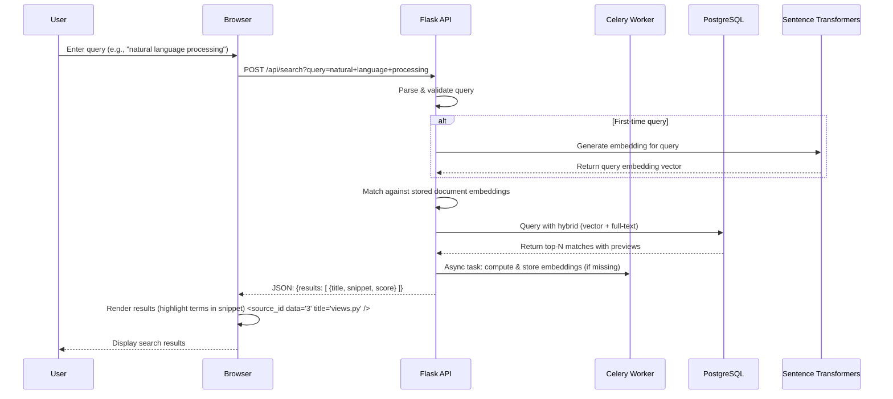

# Document Search Application

A modern document search application that allows users to upload, manage, and search through documents using semantic search capabilities.

## Features

- User authentication with email/password
- Document upload and management (PDF, TXT)
- Real-time semantic search with PostgreSQL full-text search
- Search term autocompletion
- Responsive frontend built with React and Material-UI
- Scalable backend with Flask and Celery

## Tech Stack

### Backend
- Flask (Python web framework)
- PostgreSQL (Database)
- SQLAlchemy (ORM)
- Celery (Task Queue)
- Redis (Message Broker)
- PyPDF2 (PDF Processing)
- Sentence Transformers (Semantic Search)

### Frontend
- React with TypeScript
- Material-UI
- React Query
- React Router

### Sequence Diagram



## Quick Start with Docker Compose

1. Clone the repository:
```bash
git clone https://github.com/miteshbsjat/full_stack_ai_python
cd full_stack_ai_python/
```

2. Build and start the services:
```bash
docker-compose up --build
```

This will start:
- Frontend at http://localhost:5002
- Backend API at http://localhost:5000
- PostgreSQL database
- Redis
- Celery worker for document processing

## Manual Setup

### Backend Setup

1. Create a Python virtual environment:
```bash
python -m venv venv
source venv/bin/activate  # On Windows: venv\Scripts\activate
```

2. Install dependencies:
```bash
cd backend
pip install -r requirements.txt
```

3. Initialize the database:
```bash
flask db upgrade
```

4. Start the services:
```bash
# Terminal 1: Start Redis
redis-server

# Terminal 2: Start the Flask application
flask run

# Terminal 3: Start the Celery worker
celery -A document_processor worker --loglevel=info
```

### Frontend Setup

1. Install dependencies:
```bash
cd frontend
npm install
```

2. Start the development server:
```bash
npm start
```

## Project Structure

```
.
├── backend/
│   ├── app.py              # Flask application
│   ├── config/            # Configuration files
│   ├── models/            # SQLAlchemy models
│   ├── document_processor.py  # Celery worker
│   └── requirements.txt    # Python dependencies
├── frontend/
│   ├── src/
│   │   ├── components/    # React components
│   │   ├── pages/         # Page components
│   │   └── services/      # API services
│   └── package.json       # Node.js dependencies
└── docker-compose.yml     # Docker Compose configuration
```

## API Documentation

### Authentication
- POST `/auth/register` - Register a new user
- POST `/auth/login` - Login user
- POST `/auth/logout` - Logout user
- GET `/auth/user` - Get current user

### Documents
- POST `/documents` - Upload a document
- GET `/documents` - List all documents
- GET `/documents/<id>` - Get document details
- DELETE `/documents/<id>` - Delete a document

### Search
- GET `/search` - Search documents
- GET `/search/autocomplete` - Get search suggestions

## Development

### Code Style
- Backend: Black formatter
- Frontend: ESLint and Prettier

### Running Tests
```bash
# Backend tests
cd backend
pytest

# Frontend tests
cd frontend
npm test
```

## License

MIT 
